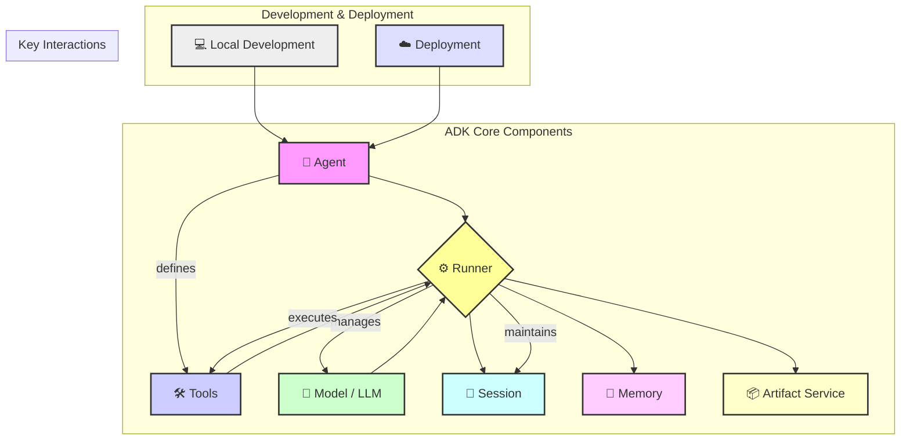

```mermaid
graph TD
    subgraph "ADK Core Components"
        A[🤖 Agent] --> R{⚙️ Runner};
        T[🛠️ Tools] --> R;
        M[🧠 Model / LLM] --> R;
        R --> S[💬 Session];
        R --> MEM[💾 Memory];
        R --> AS[📦 Artifact Service];
    end

    subgraph "Development & Deployment"
        Dev[💻 Local Development] --> A;
        Dep[☁️ Deployment] --> A;
    end

    subgraph "Key Interactions"
        A -- "defines" --> T;
        R -- "manages" --> M;
        R -- "executes" --> T;
        R -- "maintains" --> S;
    end

    style A fill:#f9f,stroke:#333,stroke-width:2px
    style T fill:#ccf,stroke:#333,stroke-width:2px
    style M fill:#cfc,stroke:#333,stroke-width:2px
    style R fill:#ff9,stroke:#333,stroke-width:2px
    style S fill:#cff,stroke:#333,stroke-width:2px
    style MEM fill:#fcf,stroke:#333,stroke-width:2px
    style AS fill:#ffc,stroke:#333,stroke-width:2px
    style Dev fill:#eee,stroke:#333,stroke-width:2px
    style Dep fill:#ddf,stroke:#333,stroke-width:2px

```
