# 🌍 Travel Agent System Architecture

## 🏗️ High-Level Overview

This system uses a **Hierarchical Agent Pattern**. 

*   **👩‍✈️ Main Travel Coordinator**: The entry point. It receives the user's travel wish, breaks it down, and delegates tasks to specialized agents.
*   **Specialized Sub-Agents**:
    *   **✈️ Flights Agent**: Finds flight options.
    *   **🏨 Hotels Agent**: Finds accommodation.
    *   **🍽️ Restaurants Agent**: Suggests dining options.
*   **💸 Budget Agent**: The final gatekeeper. It receives the chosen options and costs from the Coordinator to track expenditure and ensure it stays within limits.

## 📊 Architecture Diagram

```mermaid
graph TD
    User[👤 User] -->|Request Trip| Coordinator[👩‍✈️ Travel Coordinator]
    
    subgraph "Planning Phase"
        Coordinator -->|Find Flights| Flights[✈️ Flights Agent]
        Coordinator -->|Find Hotels| Hotels[🏨 Hotels Agent]
        Coordinator -->|Find Food| Dining[🍽️ Restaurants Agent]
        
        Flights -->|Options + Cost| Coordinator
        Hotels -->|Options + Cost| Coordinator
        Dining -->|Options + Cost| Coordinator
    end
    
    subgraph "Accounting Phase"
        Coordinator -->|Report Expenses| Budget[💸 Budget Agent]
        Budget -->|Status/Alerts| Coordinator
    end
    
    Coordinator -->|Final Itinerary| User
```



## 💻 Code Implementation

Here is a Python snippet using the `google-adk` library to demonstrate this structure.

```python
from google.adk.agents import Agent, LlmAgent
from google.adk.tools import tool

# --- 1. Define Tools for Sub-Agents ---

@tool
def search_flights(origin: str, destination: str) -> str:
    """Finds flights and returns options with prices."""
    return f"Flight {origin}->{destination}: $500 (United), $450 (Delta)"

@tool
def search_hotels(city: str) -> str:
    """Finds hotels in the given city."""
    return f"Hotels in {city}: Marriott ($200/night), Hilton ($180/night)"

@tool
def find_restaurants(city: str, cuisine: str) -> str:
    """Finds restaurants matching the cuisine."""
    return f"{cuisine} restaurants in {city}: Luigi's ($50/person), Pizza Place ($20/person)"

@tool
def log_expense(item: str, cost: float) -> str:
    """Logs an expense to the budget tracker."""
    return f"Logged: {item} for ${cost}. Budget remaining checks out."

# --- 2. Define Specialized Sub-Agents ---

# ✈️ Flight Specialist
flight_agent = Agent(
    name="flight_agent",
    model="gemini-2.5-flash",
    instruction="You are a flight expert. Find the best flight options and their prices.",
    tools=[search_flights]
)

# 🏨 Hotel Specialist
hotel_agent = Agent(
    name="hotel_agent",
    model="gemini-2.5-flash",
    instruction="You are a hotel expert. Find distinct accommodation options with prices.",
    tools=[search_hotels]
)

# 🍽️ Restaurant Specialist
restaurant_agent = Agent(
    name="restaurant_agent",
    model="gemini-2.5-flash",
    instruction="You are a culinary expert. Find dining options based on location and preferences.",
    tools=[find_restaurants]
)

# 💸 Budget Keeper
# Note: This agent might not need an LLM if it's purely deterministic, 
# but we use one here to analyze the spending.
budget_agent = Agent(
    name="budget_agent",
    model="gemini-2.5-flash",
    instruction="""You are the Budget Keeper. 
    1. Receive expense reports from the Coordinator.
    2. Log them using the log_expense tool.
    3. Warn if the total seems excessive for a standard trip.""",
    tools=[log_expense]
)

# --- 3. Define the Main Coordinator Agent ---

# 👩‍✈️ Travel Coordinator
# It has access to all other agents as 'sub_agents'
travel_coordinator = Agent(
    name="travel_coordinator",
    model="gemini-2.5-flash",
    instruction="""You are the Head Travel Coordinator.
    1. Receive a travel request from the user.
    2. Dispatch tasks to your sub-agents (flights, hotels, restaurants) to gather options.
    3. Once you have selected the best options, YOU MUST report the final costs to the 'budget_agent'.
    4. Present the final itinerary and budget status to the user.
    """,
    sub_agents=[flight_agent, hotel_agent, restaurant_agent, budget_agent]
)

# --- 4. Execution Example ---

if __name__ == "__main__":
    # This would run the agent loop
    user_request = "I want to go to Rome from New York for a weekend. I like Italian food. Budget is tight."
    
    # adk.run_agent(travel_coordinator, user_request) # Pseudocode for running
    print(f"Agent {travel_coordinator.name} is ready to process: '{user_request}'")
```
