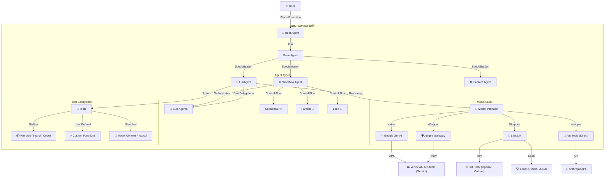

# 🏗️ ADK Architecture Overview

This diagram illustrates the high-level architecture of the Agent Development Kit (ADK), highlighting the relationships between Agents, Models, and Tools.

```mermaid
graph TD
    User["👤 User"] -->|Starts Execution| RootAgent["🤖 Root Agent"]

    subgraph "ADK Framework 📦"
        direction TB
        
        RootAgent -->|Is a| BaseAgent["Base Agent"]
        
        BaseAgent -->|Specialization| LLMA["🧠 LlmAgent"]
        BaseAgent -->|Specialization| WFA["⚙️ Workflow Agent"]
        BaseAgent -->|Specialization| CustomA["🛠️ Custom Agent"]

        subgraph "Agent Types"
            LLMA
            WFA -->|Control Flow| Seq["Sequential ➡️"]
            WFA -->|Control Flow| Par["Parallel 🔀"]
            WFA -->|Control Flow| Loop["Loop 🔁"]
        end

        %% Connections
        LLMA -->|Reasoning| Model["🔌 Model Interface"]
        LLMA -->|Action| Tools["🧰 Tools"]
        
        WFA -->|Orchestrates| SubAgents["🤖 Sub-Agents"]
        LLMA -->|Can Delegate to| SubAgents
        
        subgraph "Model Layer"
            Model -->|Native| GenAI["✨ Google GenAI"]
            Model -->|Wrapper| LiteLLM["🔗 LiteLLM"]
            Model -->|Wrapper| Apigee["🛡️ Apigee Gateway"]
            Model -->|Wrapper| Anthropic["🧠 Anthropic (Direct)"]
        end

        subgraph "Tool Ecosystem"
             Tools -->|Built-in| Prebuilt["📦 Pre-built (Search, Code)"]
             Tools -->|User Defined| CustomFunc["⚡ Custom Functions"]
             Tools -->|Standard| MCP["🔌 Model Context Protocol"]
        end
    end

    %% External Dependencies
    GenAI -->|API| Vertex["☁️ Vertex AI / AI Studio (Gemini)"]
    LiteLLM -->|API| External["🌐 3rd Party (OpenAI, Cohere)"]
    LiteLLM -->|Local| Local["💻 Local (Ollama, vLLM)"]
    Anthropic -->|API| AnthropicAPI["🧠 Anthropic API"]
    Apigee -->|Proxy| Vertex
```