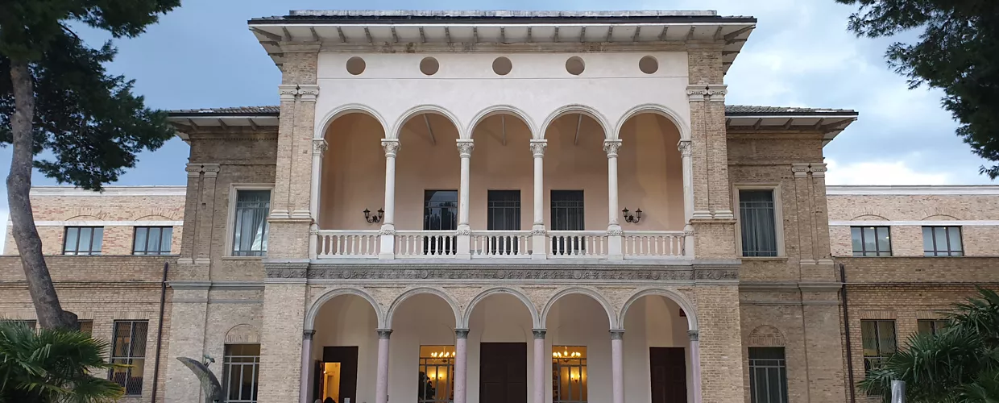

# 1. Storyboard

We want to pitch an event.

<!--  CHANGELOG
20251103 v4 - fixed MIB from Mythos to here. Better music prompt. Added my MIB swimming idea in 3 parts.
20251103 v3 - Added Aurum spec
20251103 v2 - Added MIB theme and neuralyzer
20251103 v1 - Spawned from Modena and edit main metdata.
-->

## event details

* Language of the audience: Italian
* Location: Pescara, Italy
* Event Title: "DevFest Pescara"
* Date: Sat/Sun 8-9 November 2025
* Details: a community free event, with plenty of technical talks around the Google ecosystem. The biggest event in Italy, with an Arrosticini party
* Pitch: Something contributing to "Join us for a special event" with 1000+ tickets already "SOLD" (note the event is free).
* CTA: subscribe to the event for free at https://devfest.gdgpescara.it/
* Theme: Men in Black (MIB). Ensure this element permeates the whole video, people in black/white suits, and possibly at least one neuralyzer being showed/used in 1 scene.

* Elements which should be present:
  * Gabriele d'Annunzio
  * A puffin
  * Aurum of Pescara (an amazing location where Italian G7 was held - https://aurum.comune.pescara.it/)
  * A lot of fun Google logos popping up everywhere, upbeat music (Google is the biggest sponsor).
  * A number of developers everywhere. they all wear a t-shirt, in one of the four google colors ( #4285F4 #DB4437 #F4B400 and #0F9D58 )
  * We need to give a sense of this huge community, so you should show a diverse crowd of Italian developers, of all ages, based in Pescara, and show big crowds of 100-300 people inside an event space (Aurum, a big oval building with a grand piano in the room), in a typical tech event setup.

## MIB Narrative Concept

To fully embrace the "Men in Black" theme, the video should follow a short narrative arc:

1.  **The Calm Before:** Start with serene, beautiful shots of Pescara (or Rome, for more recognizable landmarks). Show key locations like the sea, the city center, and the Aurum building. The atmosphere is peaceful, with ambient sounds like seagulls. (Approx. 4-8 seconds).

2.  **The Hidden Threat:** Introduce a sense of mystery. The music shifts to a suspenseful crescendo. We get glimpses of colorful, Pixar-style monsters lurking in the shadows or behind famous landmarks. The idea is that a hidden, fantastical world coexists with our own.

3.  **The Agents Assemble:** The music dramatically shifts to an upbeat, MIB-inspired theme. Google Developers, now styled as MIB agents (crisp black suits, white shirts, black sunglasses), appear on the scene. They are competent, cool, and ready to handle the situation, showcasing their role as the "protectors" who manage the unseen complexities (the "monsters"). This is where we can subtly tie in the idea of developers solving complex tech problems.

## About the location (Aurum)

Aurum in Pescara looks like a historic building with a unique round shape, a mixture of Art Nouveau and 1930s rationalist architecture, and large windows that create a bright interior. Originally a bathhouse and later a distillery, it has been renovated and now serves as a cultural center, "La Fabbrica delle Idee" (The Idea Factory). The exterior showcases the original Art Nouveau facade from 1910, with a modern, horseshoe-shaped expansion designed by Giovanni Michelucci.

See  for the facade.

Note that Aurum will be difficult to reproduce, so you might want to be prescriptive on how the building looks like.

## Execution

* Create a `DESIGNATED_FOLDER` with name like `YYYYMMDD-HHMM)-CUJ03-(STORY_TITLE)/`, based on *current date* and *title*. It should be under `out/pescara/demo02/`
  * Create a `README.md` file in it.
* The final video should be around 30-40 seconds at most.

## Storyboard

* Now lets create a storyboard for this story and then N videos from it.
* output the storyboard into the `$DESIGNATED_FOLDER/storyboard.md`
  * Each scene (6-8sec scene) should be in a H2 ("## Scene XX: ...") so easy to isolate
  * It should contain both the the context AND the prompt.
  * Videos might be ugly, we might need to be able to redo them at a later time so "recast scene4" is something we should be able to do easily, hence this convention.
* If in interactive mode, validate output with user; if not, proceed.
* Be prescriptive of which scene should have music, and which should have audio, eg characters speaking.
  * If a conversation among 2+ people, use **Veo3** to generate audio.
  * If music, use MCP `Lyria` tools.
  * If a lot of audio needs to be deterministically added to the scene, maybe better to use Chirp model and tool.
  * Note music is usually MUCH longer than 8sec, so maybe you need to crop it 8 sec and maybe add some fade in/out effects not to make it too abrupt.
* The storyboard should contain instructions for further AUDIO computation, so explain which model should be used depending on the use.
* Do not exaggerate with text on the single videos, no more than 2-3 words in it, or it gets imprecise.
  * If more needs adding, we can do it in post-production with online tools. Just make sure this is in some TODO() for later.

## Iterating the scenes

For each scene, do this (eg for scene 1):

1. Take scene 1 from Markdown
2. Create "2" videos for this scene and call it `scene1_takeX.mp4` for each take.
   1. Use the Veo 3 fast model for both takes.
3. Add info about this to the `README.md` in a table. the table should contain:
   1. scene_time_start (seconds), eg 00:00
   2. scene_time_end (seconds), eg 00:07
   3. Short description (max 7 words)
   4. Link to the file (take1)
   5. Prompt used (in italic)

## Add the audio

## Final merge

Once done,

1. Merge the videos in a single video.
   1. For each scene, you can ask user to evaluate the best, or choose a random one.
   2. The readme should link the CHOSEN take (eg `scene1_take2`, `scene2_take1`, ..) for ease of reproduction.
2. Update the README with link to final video and summarize what it's about.
3. Add or use (if built already) a `bin/assemble_[new_]video.sh` which contains the deterministic FFMPG command to generate the final video starting from the original ones, so user can tweak the result. Note some might be already present in `bin/` - do NOT reinvent the wheel!
