# Story Generation for Alessandro

This document outlines the process of generating a story and its assets for Alessandro.

## Workflow

The following graph illustrates the workflow used to generate the story, audio, images, and video.

```mermaid
graph TD
    subgraph Story Generation
        A[💡 Initial Prompt] --> B{Story Engine};
        B --> C[📄 story-en.txt];
        B --> D[📄 story-it.txt];
        B --> E[📄 story-de.txt];
    end

    subgraph Audio Generation
        C --> F{Audio Engine};
        F --> G[🔊 story-en.wav];
        D --> H{Audio Engine};
        H --> I[🔊 story-it.wav];
        E --> J{Audio Engine};
        J --> K[🔊 story-de.wav];
    end

    subgraph Asset Generation
        C --> L{Image Engine};
        L --> M[🖼️ start-1.png, ..., start-4.png];
        L --> N[🖼️ finale-1.png, ..., finale-4.png];
        C --> O{Video Engine};
        O --> P[🎥 trailer.mp4];
    end
```

## Simplified Workflow

Here is a simplified version of the workflow, showing only the direct relationships between the generated files.

```mermaid
graph TD
    A[💡 Initial Prompt] --> B[📄 story-en.txt];
    A --> C[📄 story-it.txt];
    A --> D[📄 story-de.txt];

    B --> E[🔊 story-en.wav];
    C --> F[🔊 story-it.wav];
    D --> G[🔊 story-de.wav];

    B --> H[🖼️ start-1.png, ..., start-4.png];
    B --> I[🖼️ finale-1.png, ..., finale-4.png];
    B --> J[🎥 trailer.mp4];
```

## Generated Files

The following files were generated in this process:

*   **Stories:**
    *   `story-en.txt`
    *   `story-it.txt`
    *   `story-de.txt`
*   **Audio:**
    *   `story-en.wav`
    *   `story-it.wav`
    *   `story-de.wav`
*   **Images:**
    *   `start-1.png`
    *   `start-2.png`
    *   `start-3.png`
    *   `start-4.png`
    *   `finale-1.png`
    *   `finale-2.png`
    *   `finale-3.png`
    *   `finale-4.png`
*   **Video:**
    *   `trailer.mp4`