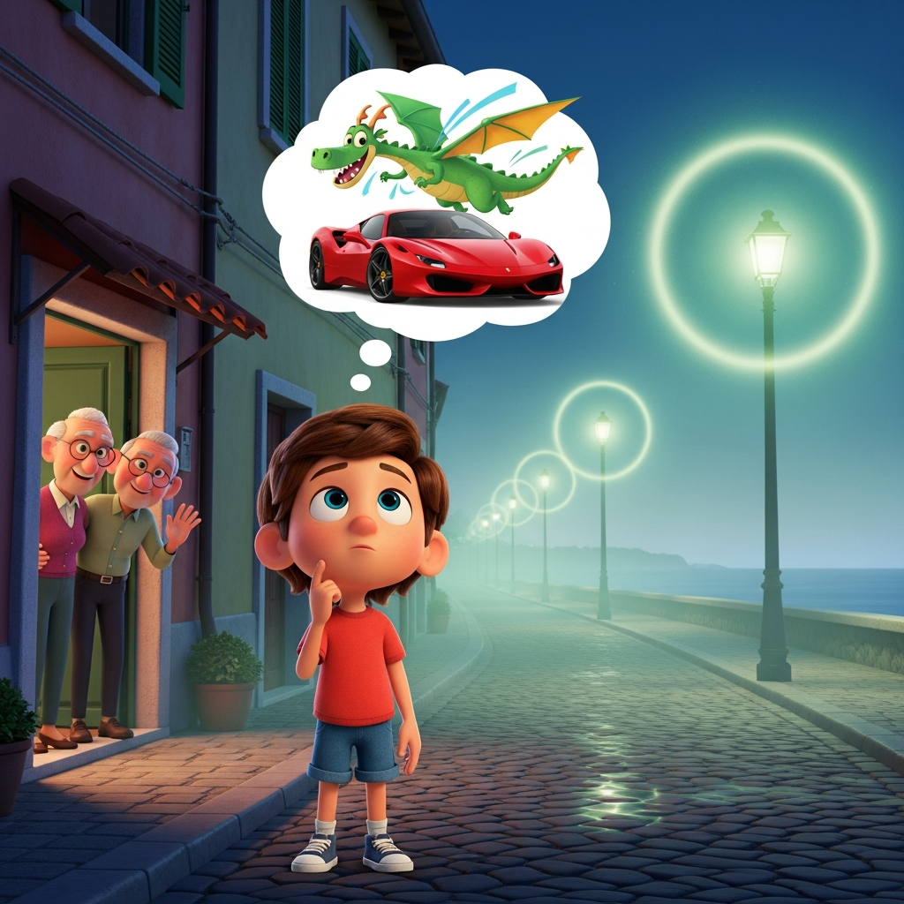
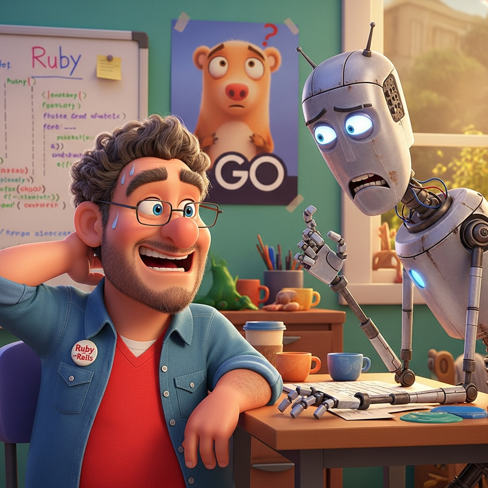
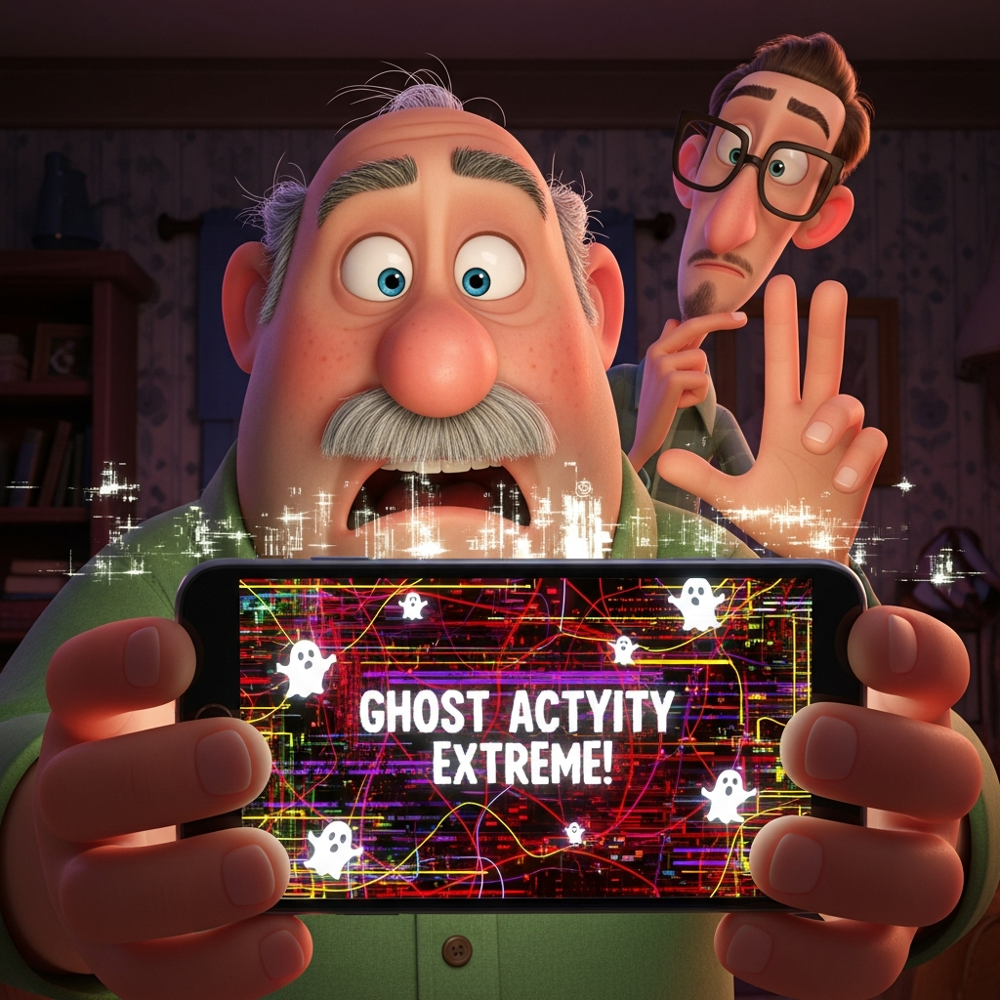

## Alessandro e le Spiagge Sussurranti di Pescara

Alessandro, un coraggioso bambino di sette anni con un cuore pieno di draghi e una mente che sognava Ferrari, stava visitando i suoi nonni a Pescara. La città, solitamente brulicante di vita, stasera sembrava diversa. Una strana nebbia si era alzata dal Mare Adriatico, facendo brillare i lampioni con un'aura inquietante.

"È una notte perfetta per gli arrosticini!" esclamò Nonno, mentre il delizioso profumo degli spiedini di agnello alla griglia riempiva l'aria. Alessandro, nonostante il suo amore per quelle prelibatezze salate, sentì un brivido che non proveniva dalla fresca brezza serale.

Improvvisamente, un ronzio ruppe il silenzio. "Oh, per l'amore di tutto ciò che è logico, un'altra crisi esistenziale," mormorò Marvin, il compagno androide paranoico di Alessandro, i suoi sensori ottici che tremolavano nervosamente. "La probabilità di un consumo di arrosticini di successo senza incidenti sta diminuendo rapidamente."

Zio Fabio, un programmatore Ruby di Dublino, ridacchiò. "Non preoccuparti, Marvin. Probabilmente è solo l'aria di mare che gioca brutti scherzi." Ma anche Zio Fabio sembrava un po' a disagio.

"Forse," intervenne Zio Luca, un convinto sostenitore di Linux e dell'open-source, "stiamo assistendo a un fenomeno che va oltre le semplici condizioni atmosferiche. Come direbbe Richard Stallman, 'Il software libero è una questione di libertà, non di prezzo.' Ma che dire degli spiriti liberi?"

Mentre camminavano lungo la spiaggia deserta, la nebbia si fece più fitta. Alessandro, solitamente impavido, strinse più forte il suo peluche Pokémon preferito. Scorse qualcosa che luccicava nella sabbia – un rubino, rosso intenso e scintillante. Si chinò per raccoglierlo, e mentre le sue dita toccavano la pietra, un sussurro echeggiò dalle onde:

*"Onde che mormorate segreti antichi,
Svelate il velo della notte infinita."*

"L'hai sentito?" sussurrò Alessandro, con gli occhi spalancati.

I sensori di Marvin ronzarono. "Anomalia audio rilevata. L'analisi linguistica suggerisce poesia italiana arcaica. Probabilità di manifestazione spettrale: 73,4%."

Zio Fabio tirò fuori il telefono, "Il mio script Ruby per il rilevamento dei fantasmi sta impazzendo!"

Zio Luca, sempre pragmatico, cercò di razionalizzare. "È solo il vento, Alessandro. O forse una registrazione dello stesso Gabriele D'Annunzio, portata dalla brezza."

Ma Alessandro sapeva meglio. Il rubino pulsava caldamente nella sua mano. Guardò il mare, dove la nebbia sembrava avvolgersi nella forma di un magnifico, etereo drago, i suoi occhi che brillavano come oro fuso. Non era spaventoso, non proprio. Era un'avventura, un segreto sussurrato dalle antiche spiagge di Pescara, una storia solo per lui, il suo prezioso rubino e il suo amico androide meravigliosamente paranoico. E forse, solo forse, qualche altro arrosticino avrebbe reso tutto ancora migliore.