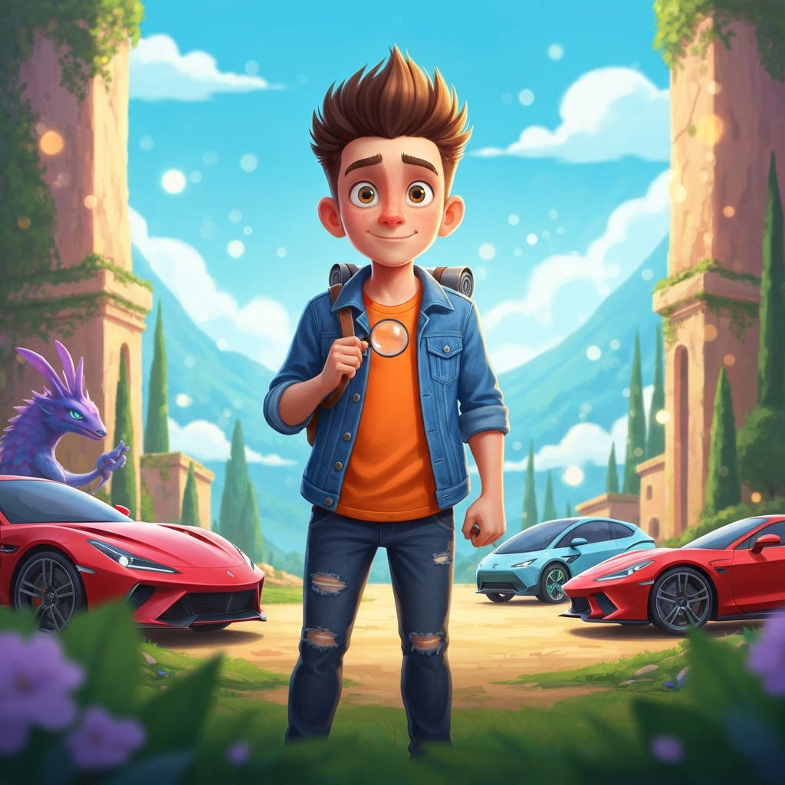
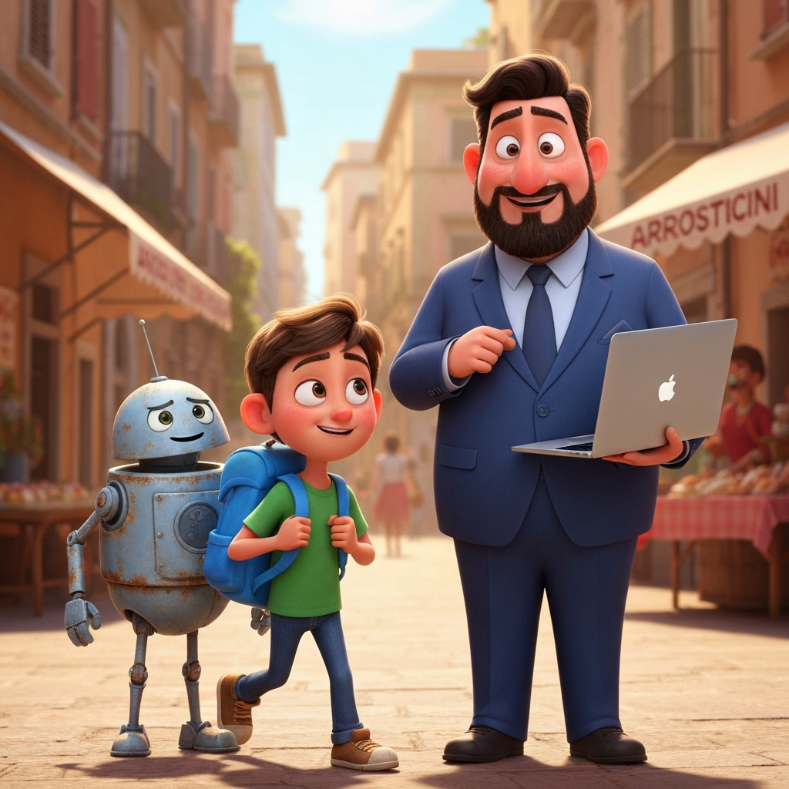
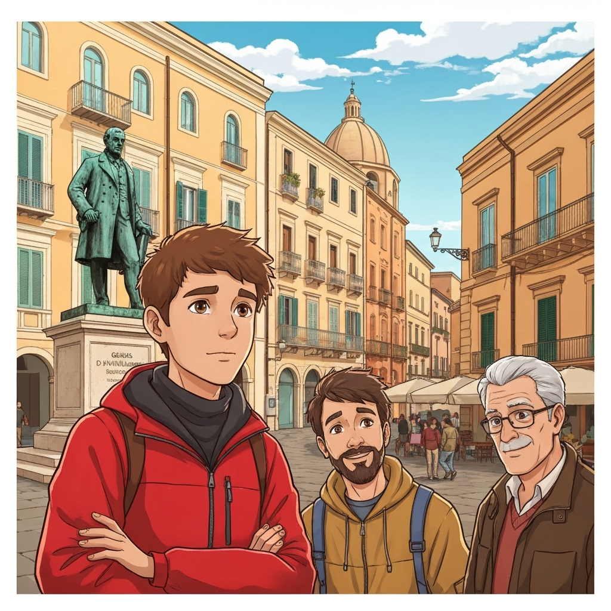
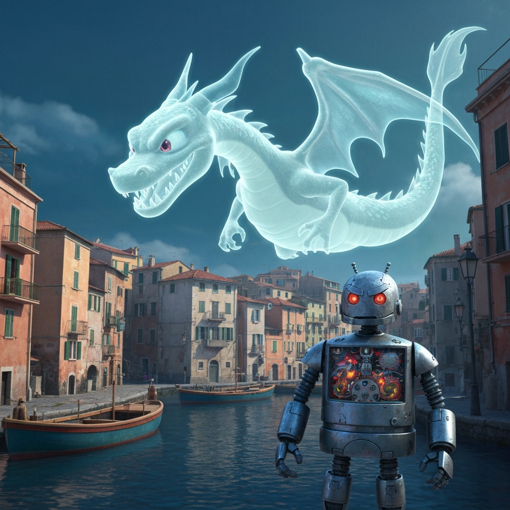
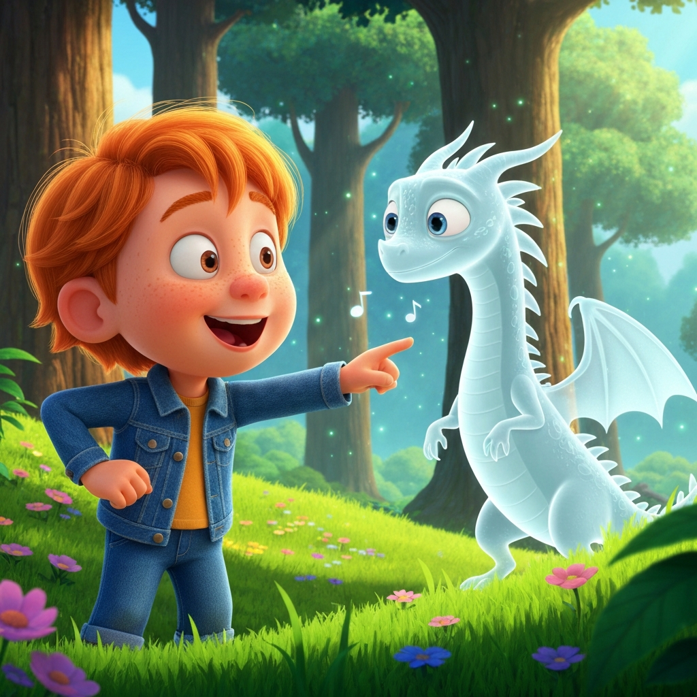
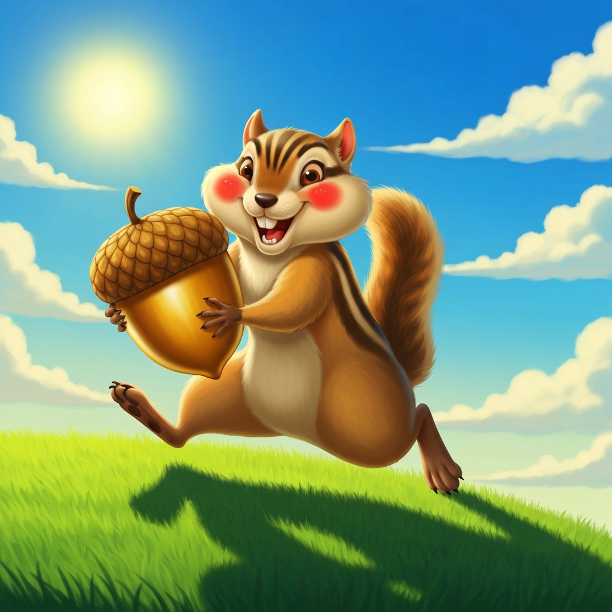
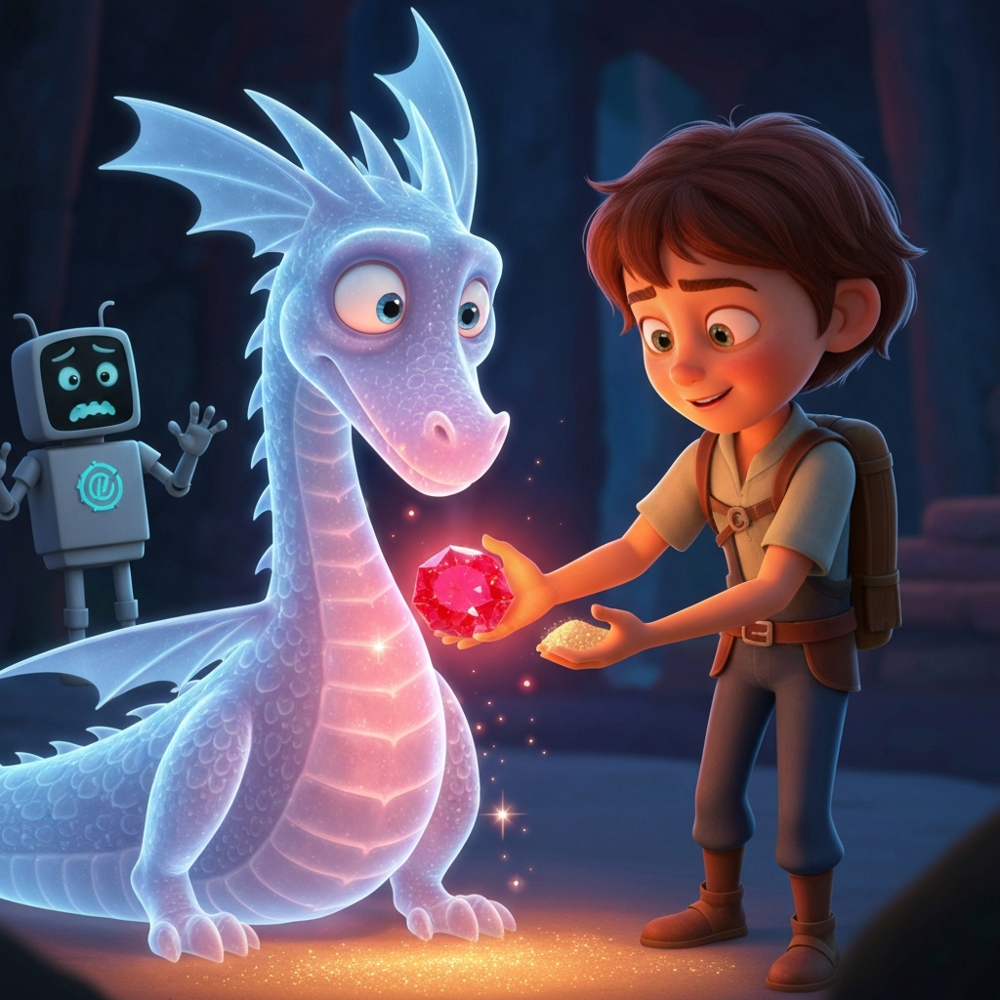
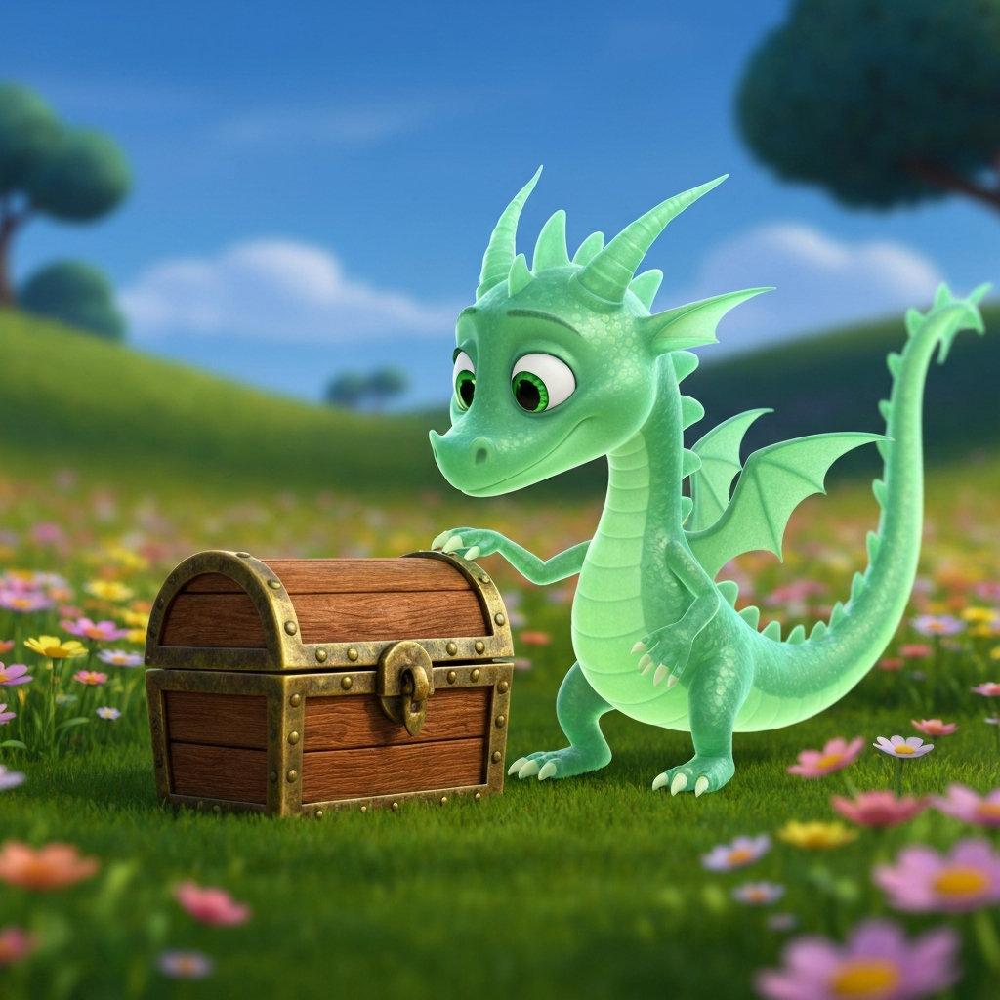
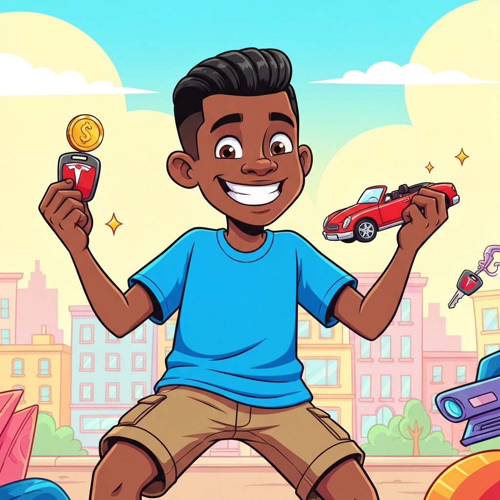
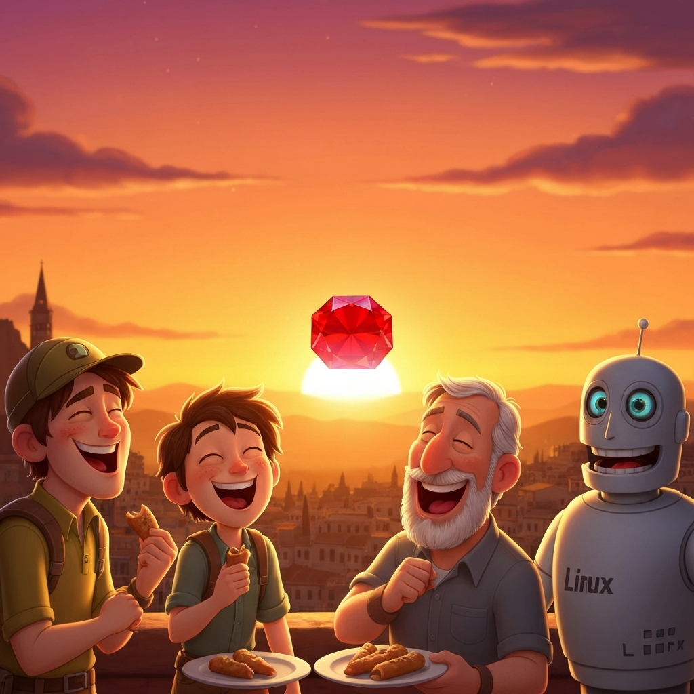

# Alessandro and the Whispering Dragon of Pescara

Alessandro, a bright 7-year-old from Zurich, with an Italian dad and an English mum, loved many things: the sleek lines of a Ferrari, the mystery of a Pokémon, the power of a Tesla, and most of all, the shimmering allure of gold and rubies. But today, in Pescara, a different kind of adventure awaited him.

He was visiting his Uncle Fabio, a Ruby programmer from Dublin, and Uncle Luca, a Linux enthusiast who often quoted Richard Stallman. With them was Marvin, a slightly rusty, perpetually paranoid android. "Oh dear, oh dear," Marvin whirred, his optical sensors darting nervously. "I detect a 97.3% probability of impending doom. The seagulls are looking at me funny."

"Nonsense, Marvin!" laughed Alessandro, his eyes sparkling. "We're going for arrosticini!"

Pescara was buzzing. The smell of grilling arrosticini filled the air, making Alessandro's stomach rumble. They walked past the elegant statue of Gabriele D'Annunzio, whose words Uncle Luca often recited. Today, Alessandro remembered two lines:
"***La pioggia nel pineto***
***Cade su le soglie silenziose***"

Suddenly, a strange, low hum vibrated through the ground. The air grew cold, and the scent of ozone filled their noses. Marvin's whirring intensified. "Probability of doom just increased to 99.9%! Run for your lives!"

A shimmering, translucent dragon, not unlike a ghostly Charizard, appeared above the old fishing boats. It wasn't roaring, but whispering, its voice like rustling leaves and distant thunder. It seemed to be searching for something.

"It's a Whisper Dragon!" exclaimed Alessandro, remembering a rare Pokémon card. "It's looking for treasure!"

Uncle Fabio, ever the logical programmer, pulled out his laptop. "Let's see if I can 'debug' this situation. Perhaps a Ruby script can calm it down?"

Uncle Luca, meanwhile, was already trying to explain the dragon's plight. "It's probably a victim of proprietary magic, forced to guard some ancient, closed-source treasure! We must liberate it!"

Marvin, however, was convinced the dragon was after his internal wiring. "My precious circuits! It wants my data! I knew this would happen!"

Alessandro, brave and curious, noticed something glinting on the dragon's chest: a large, dull ruby. "It's sad!" he realized. "The ruby has lost its sparkle!"

He remembered his dad telling him about a special kind of Pescara sand that could polish anything. He found a handful near the beach, ran towards the dragon (much to Marvin's horror), and gently rubbed the sand on the ruby.

The ruby began to glow, then shimmered with a brilliant, fiery red. The Whisper Dragon let out a soft, contented sigh, its translucent form becoming more solid, its whispers turning into a gentle, melodic hum. It wasn't scary anymore, just magnificent.

As a thank you, the dragon gently nudged a small, ancient chest towards Alessandro. Inside, nestled on a bed of soft moss, were not just gold coins, but also a tiny, perfectly formed Ferrari made of pure ruby, and a miniature Tesla key, sparkling like a diamond.

"See, Marvin?" Alessandro grinned, holding up his treasures. "Not doom, just a little bit of magic!"

Marvin, still whirring, scanned the treasures. "Probability of doom now 0.01%. Still, one can never be too careful. Perhaps we should install a firewall around these rubies?"

They all laughed, even Uncle Luca, who was already planning an open-source project to document the Whisper Dragon's polishing technique. And as the sun set over Pescara, casting a golden glow on the newly polished ruby, Alessandro knew this was an adventure he'd never forget. And the arrosticini tasted even better after saving a dragon.