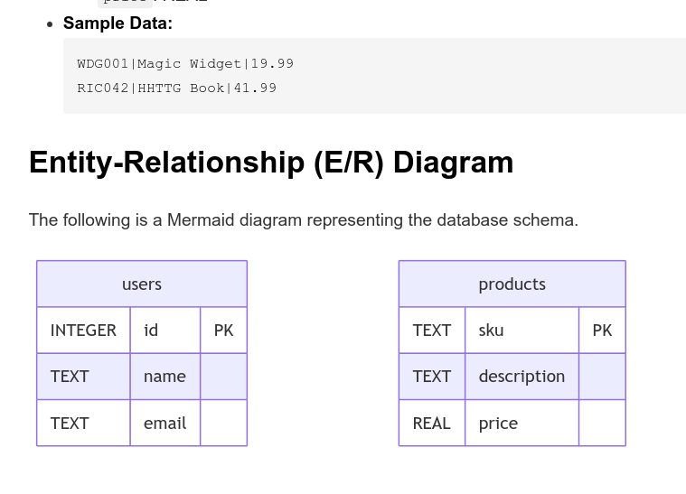

This demo showcases how `gemini-cli` is able to:
* read/write/understand a sqlite3.
* Generate E/R schema based on it.

## Demo Video

## How to use this demo

1. See some sample invocations in `DEMO_SCRIPT.md`
2. See a potential output in `OUTPUT.md`.

First invocation:

Wow moment:

## TODOs

Maybe integrate with [Chinook](https://www.sqlitetutorial.net/sqlite-sample-database/) which seems like a GREAT starting repo.

Maybe reverse engineer it into a `./create-db.sh` and add Riccardo Carlesso as a user who likes DreamTheater, and add a column `can_play_on_piano`.
