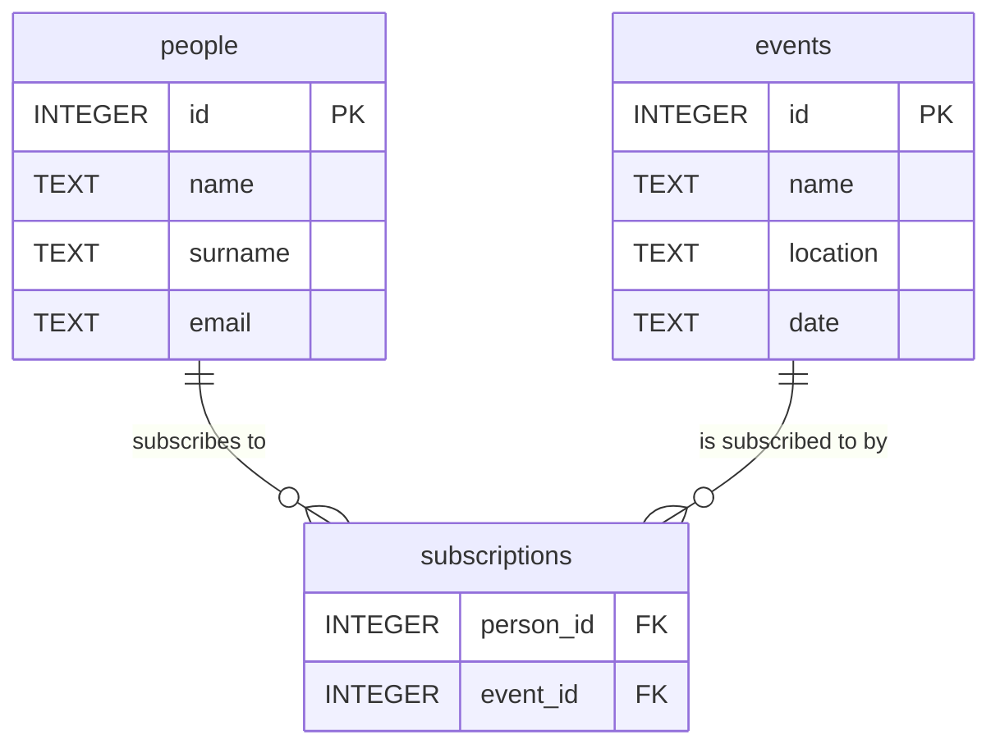

# events_and_people.sqlite

## Schema

```sql
CREATE TABLE events (
  id INTEGER PRIMARY KEY,
  name TEXT NOT NULL,
  location TEXT,
  date TEXT
);

CREATE TABLE people (
  id INTEGER PRIMARY KEY,
  name TEXT NOT NULL,
  email TEXT UNIQUE,
  surname TEXT
);

CREATE TABLE subscriptions (
  person_id INTEGER,
  event_id INTEGER,
  FOREIGN KEY(person_id) REFERENCES people(id),
  FOREIGN KEY(event_id) REFERENCES events(id),
  PRIMARY KEY (person_id, event_id)
);
```

## Sample Data

### events

| id | name | location | date |
|---|---|---|---|
| 1 | Tech Conference 2025 | Virtual | 2025-10-15 |
| 2 | Local Hackathon | City Library | 2025-11-01 |

### people

| id | name | surname | email |
|---|---|---|---|
| 1 | Alice | Smith | alice@example.com |
| 2 | Bob | Jones | bob@example.com |

### subscriptions

| person_id | event_id |
|---|---|
| 1 | 1 |
| 1 | 2 |

## Entity-Relationship Diagram

