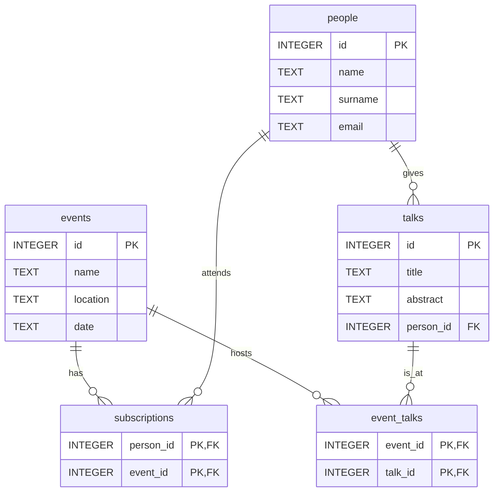

# `events_and_people.sqlite` Database Analysis

## Description

The `events_and_people.sqlite` database contains information about events, people, their subscriptions to events, and talks given at events.

### `events` table

This table stores event information.

-   **Schema:**
    ```sql
    CREATE TABLE events (
      id INTEGER PRIMARY KEY,
      name TEXT NOT NULL,
      location TEXT,
      date TEXT
    );
    ```

### `people` table

This table stores people information.

-   **Schema:**
    ```sql
    CREATE TABLE people (
      id INTEGER PRIMARY KEY,
      name TEXT NOT NULL,
      surname TEXT,
      email TEXT UNIQUE
    );
    ```

### `subscriptions` table

This table links people to events they are subscribed to.

-   **Schema:**
    ```sql
    CREATE TABLE subscriptions (
      person_id INTEGER,
      event_id INTEGER,
      FOREIGN KEY(person_id) REFERENCES people(id),
      FOREIGN KEY(event_id) REFERENCES events(id),
      PRIMARY KEY (person_id, event_id)
    );
    ```

### `talks` table

This table stores information about talks.

-   **Schema:**
    ```sql
    CREATE TABLE talks (
      id INTEGER PRIMARY KEY,
      title TEXT NOT NULL,
      abstract TEXT,
      person_id INTEGER,
      FOREIGN KEY (person_id) REFERENCES people(id)
    );
    ```

### `event_talks` table

This table links talks to events.

-   **Schema:**
    ```sql
    CREATE TABLE event_talks (
      event_id INTEGER,
      talk_id INTEGER,
      PRIMARY KEY (event_id, talk_id),
      FOREIGN KEY (event_id) REFERENCES events(id),
      FOREIGN KEY (talk_id) REFERENCES talks(id)
    );
    ```

## Entity-Relationship (E/R) Diagram

The following is a Mermaid diagram representing the database schema.


