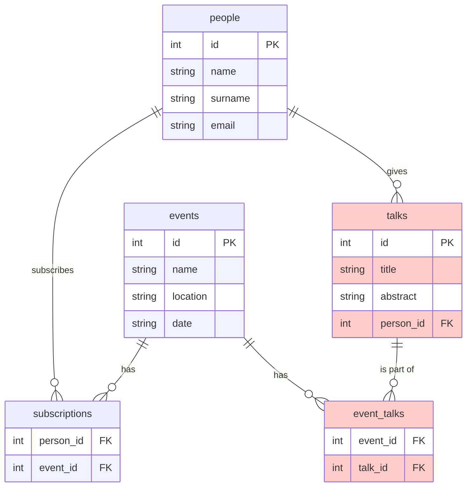

## Database Schema

```sql
CREATE TABLE events (
  id INTEGER PRIMARY KEY,
  name TEXT NOT NULL,
  location TEXT,
  date TEXT
);
CREATE TABLE people (
  id INTEGER PRIMARY KEY,
  name TEXT NOT NULL,
  surname TEXT,
  email TEXT UNIQUE
);
CREATE TABLE subscriptions (
  person_id INTEGER,
  event_id INTEGER,
  FOREIGN KEY(person_id) REFERENCES people(id),
  FOREIGN KEY(event_id) REFERENCES events(id),
  PRIMARY KEY (person_id, event_id)
);
CREATE TABLE talks (
    id INTEGER PRIMARY KEY,
    title TEXT NOT NULL,
    abstract TEXT,
    person_id INTEGER,
    FOREIGN KEY(person_id) REFERENCES people(id)
);
CREATE TABLE event_talks (
    event_id INTEGER,
    talk_id INTEGER,
    FOREIGN KEY(event_id) REFERENCES events(id),
    FOREIGN KEY(talk_id) REFERENCES talks(id),
    PRIMARY KEY (event_id, talk_id)
);
```

## E/R Diagram (Mermaid)


