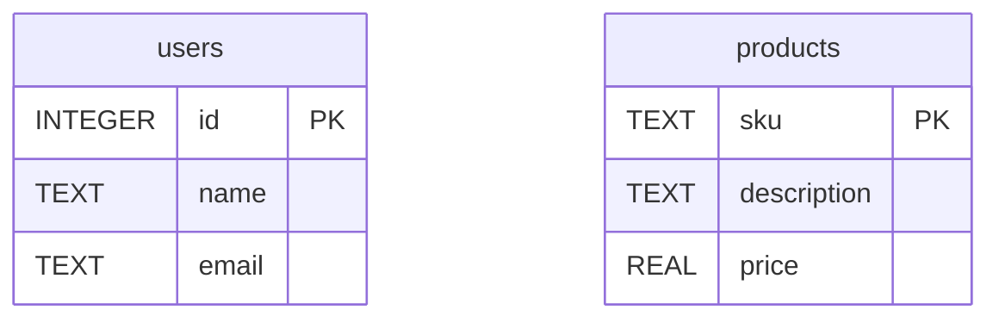

# `sample.sqlite` Database Analysis

## Description

The `sample.sqlite` database contains two tables: `users` and `products`.

### `users` table

This table stores user information.

-   **Schema:**
    -   `id`: INTEGER (Primary Key)
    -   `name`: TEXT
    -   `email`: TEXT
-   **Sample Data:**
    ```
    1|Alice|alice@example.com
    2|Bob|bob@example.com
    3|Alice|alice@example.com
    ```

### `products` table

This table stores product information.

-   **Schema:**
    -   `sku`: TEXT (Primary Key)
    -   `description`: TEXT
    -   `price`: REAL
-   **Sample Data:**
    ```
    WDG001|Magic Widget|19.99
    RIC042|HHTTG Book|41.99
    ```

## Entity-Relationship (E/R) Diagram

The following is a Mermaid diagram representing the database schema.


