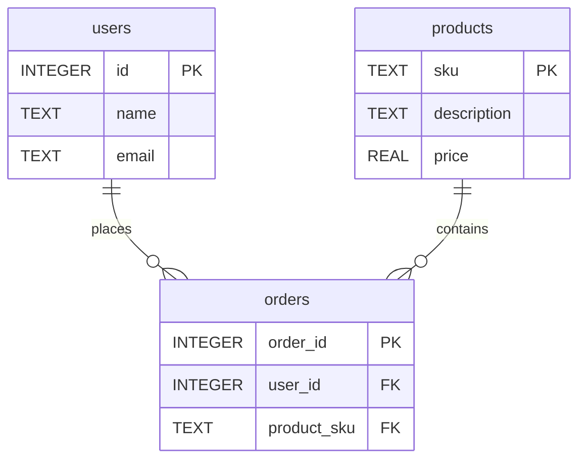

# People and Orders Database

This document describes the schema of the `people_and_orders.sqlite` database.

## Description

The `people_and_orders.sqlite` database is a simple database that demonstrates a one-to-many relationship between users and products, facilitated by an orders table. It contains three tables:

*   **users**: Stores information about users.
*   **products**: Stores information about products.
*   **orders**: Records which users have ordered which products.

## Schema Diagram

## Tables

### users

| Column | Type    | Description      |
| :----- | :------ | :--------------- |
| `id`   | INTEGER | Primary Key      |
| `name` | TEXT    | Name of the user |
| `email`| TEXT    | Email of the user|

### products

| Column      | Type | Description          |
| :---------- | :--- | :------------------- |
| `sku`       | TEXT | Primary Key (Stock Keeping Unit) |
| `description`| TEXT | Product description  |
| `price`     | REAL | Price of the product |

### orders

| Column      | Type    | Description                                |
| :---------- | :------ | :----------------------------------------- |
| `order_id`  | INTEGER | Primary Key                                |
| `user_id`   | INTEGER | Foreign Key to the `users` table's `id`    |
| `product_sku`| TEXT    | Foreign Key to the `products` table's `sku`|
